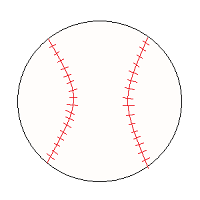

Baseball
========
Baseball is called America's favorite pastime, but has now become popular in many parts of the world. The MLB is the oldest of any sports league in
America, beginning with its roots in the "National League" in 1876. Baseball players come from all over the world to compete in America.
This creates a diverse group of varying skillsets for each of the 30 teams in the MLB. After over almost 150 years, Baseball has held strong as one of America's most popular sports.

Explore Baseball!
-----------------

.. toctree::
   :maxdepth: 1

   baseball_rules.rst
   baseball_history.rst
   baseball_players.rst
   baseball_records.rst