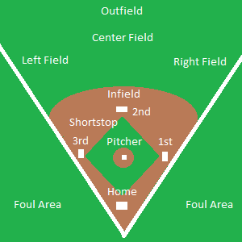
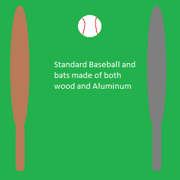

The Rules of Baseball
=====================

Basic Rules
-----------

Baseball games consist of two teams of 9 players. There are 3 parts to a field; the infield, outfield, and foul area. 
One team is in the field and the other is “at bat”. Each team alternates whether they are batting or fielding. 

Fielding
--------

The team in the field has players in 9 positions. These consist of:
	* Pitcher
	* 1st baseman
	* 2nd baseman
	* shortstop
	* 3rd baseman
	* Catcher
	* Left Fielder
	* Center Fielder
	* Right Fielder

Each person in the field wears a padded glove to catch the baseball when thrown to them. The goal of the fielding team,
is to get the other team "out". This is done by catching the ball after it is hit. Another way to get an out is to throw the ball to the player
at one of the four bases, so they can tag the runner and get them out. The final way to get the player out, is for the pitcher to pitch three strikes to the batter.

Batting
-------
Each player on the team gets a chance to bat. While the team is "at bat", each player wears a hard plastic and foam batting helmet, and most likely batting gloves. The batter takes his Wooden/Alluminum bat,
depending on what league you play in, and stands in the "batters box", next to home plate. This is where the magic happens. The Pitcher stands on the pitcher's mound
and throws the ball towards the catcher who stands behind home plate. The batter attempts to hit the ball while it is still in the air. If the batter makes a valid hit,
then they drop the bat and run towards first base, and each base after, at their own disgression. Only one player can stand on a base at a time, so deciding where to go is important.

Types of Hits
-------------
As stated earlier, there are three sections to a baseball field. When a batter gets a hit, the ball will travel to one of these sections.
The three main hits are ground ball, line drive, and fly ball. A ground ball is when the baseball hits the ground and rolls for any length of the field, typically the infield. A line drive is
when the ball flies in a straight path that is semi-low to the ground and often make it into the outfield. A pop fly is when the ball is hit very high into the air travels either to the
infield or outfield. This is a very common way to get an out though.

There are two other common hits that occur in nearly every game of professional baseball; the foul ball, and the home run. A foul ball is when the ball is hit into the foul area of the field. 
This adds 1 strike to the player but cannot get the player out, unless caught. If a foul ball occurs, any progress the players made around the bases during that hit are un-done.
It is essentially a re-do. The lucrative home run occurs when the ball is hit so far that it flies outstide of the field and over the surrounding fence.
This adds 1 point to the teams score, and any runner on the bases automatically scores. If there are three runners on the bases and a home run is made, it is called a grand-slam.

Advancing the Game
------------------
Each team gets three outs per inning. After a team gets three, the teams switch places. In the MLB, games last 9 innings. As previously mentioned there are three ways to get an out.
The best way to get someone out is by the pitcher pitching three strikes. This leaves no chance of the batter possibly scoring. This is difficult though due to the nature of the "strike zone".
The strike zone is an imaginary rectangular box that reaches from the batter's shoulders, to his knees. If a pitch is thrown in this area it is a strike. Also it is prime
location for hitting the ball. If a ball does not land inside the strike zone, then it is a "ball". After four "balls" a player is forced to go to first base without hitting; this is called a "walk".
If a player reaches all four bases during an inning, then that counts as a "run" and adds 1 point to the team's score. There is no score limit, but there are certain rules limiting to 
how badly a team can lose. If a team is losing by 10 points within the first few innings of the game, "mercy rule" ends the game pre-maturely. This is to save both time 
and energy for the players who don't wish to continue a game such as this. 

