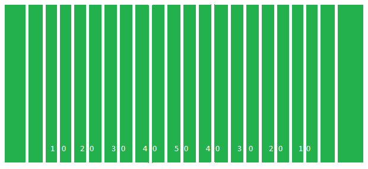

Football Rules
==============

The Basics
----------

Football is a game played between two teams. There are different 
levels of play from youth leagues to the National Football League
(NFL). Each team plays with 11 players on the field at once, for a 
total of 22 players on the field at once. One team gets possession 
of the ball at a time, this team is called the offense. The other 
team is the defense. Possession transfers between teams after a 
series of plays that ends in either a score, a turnover, or 
time running out. Plays that transition between possessions are 
called special teams.

The Field
---------
Football is played on a field that is 120 yards long and 53 yards 
wide. The playing surface is 100 yards long with an endzone at each 
end. Behind the endzone is the field goal post. 

Possessions
-----------
A possession consists of 'downs' and 'plays.' The goal of the offense 
is to progress 10 yards 4 downs at a time. Each down is a chance for 
the offense to run a play and gain as many yards as possible, 
beginning with 1st down. The defense attempts to stop the offense 
from gaining yards. When the offense gains at least 10 yards they 
get another set of 4 downs. If the defense prevents them from gaining 
10 yards a turnover occurs and the other team gets possession of the 
ball.

Special Teams
-------------
Special teams are a large part of the game of football. Each game 
begins with a kickoff. This play consists of a kicking and receiving 
team. They flip a coin before the game to determine which team kicks 
and which team receives. The receiving team catches the ball and runs 
forward to gain yards until the kicking team tackles the runner. The 
receivings team's offense then comes on the field and begins thier 
possession. If the team does not make it 10 yards during their four 
downs they can choose to punt on fourth down. This forces the other 
team to begin their drive with worse field position. The offense also 
has a second option. If they are close enough they can attempt to 
kick the ball through the goal posts for 3 points. 

Scoring
-------
When a team makes it to the endzone they score a touchdown and 
receive 6 points. They then get the opportunity to score an extra 
point or a two point conversion. For an extra point the offense must 
kick the ball between the field goal posts for 1 point. For a two 
point conversion the offense must make it into the endzone again for 
2 points. As mentioned a team can kick a field goal if they aren't 
able to score a touchdown. They must kick the ball through the field 
goal post for 3 points

